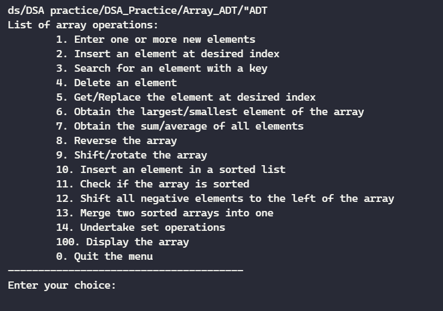
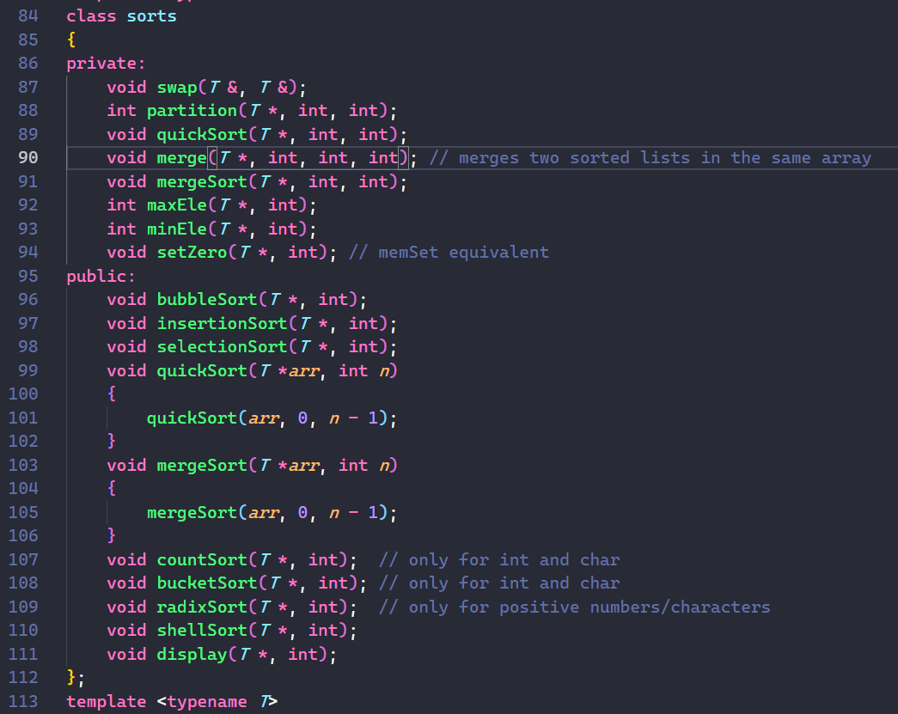
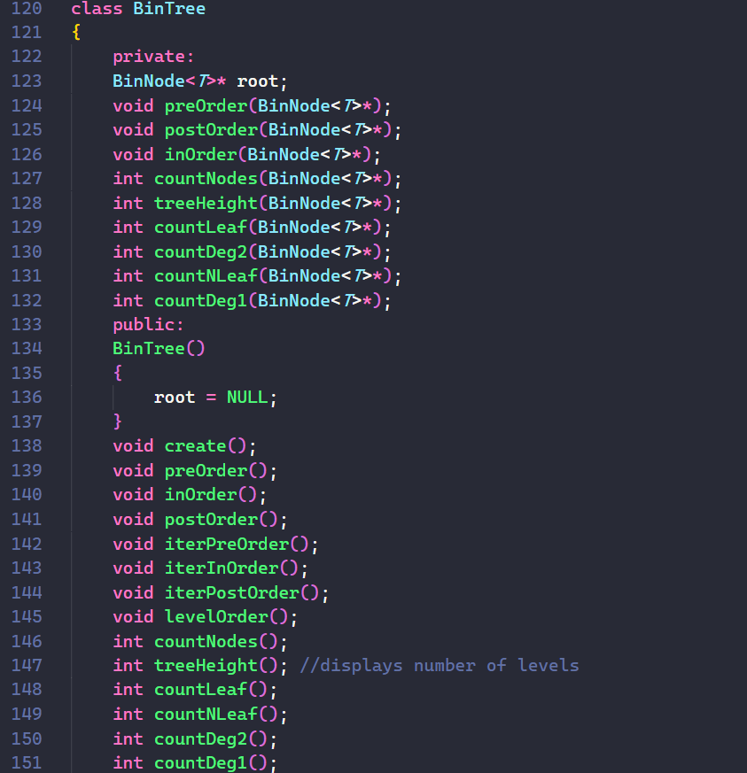
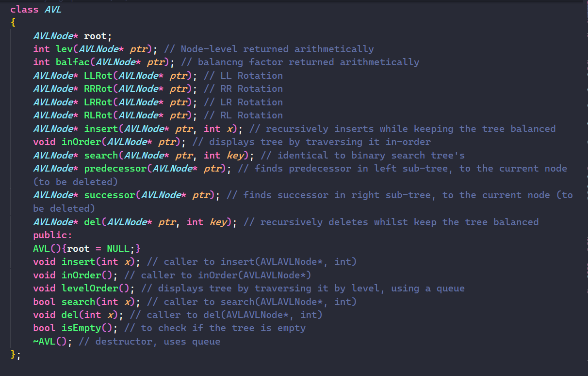
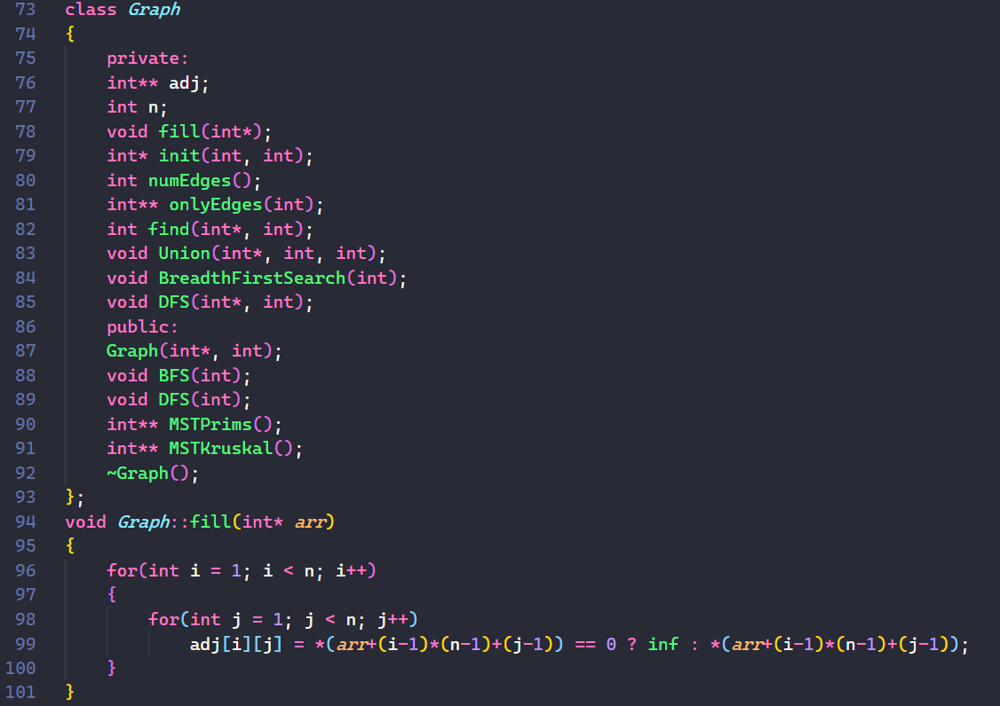

# Mastering Data Structurs and algorithms in C/C++

This repository contains notes and practice files from the [Data Structures and Algorithms course on Udemy](https://www.udemy.com/course/datastructurescncpp/) by Mr Abdul Bari.
Efforts were made to make the files as readable as possible, by Commenting the code and adding explanations still there is room for improvement.


<center> Array</center>



<center> Sorting Algorithms</center>



<center> Binary Tree</center>



<center> AVL Tree</center>




<center> Graph</center>




## Description

The course tackles the most common data structres and algorithms in the [C](https://en.wikipedia.org/wiki/C_(programming_language)) 
and [C++](https://en.wikipedia.org/wiki/C%2B%2B) programming languages. Structres include [arrays](https://en.wikipedia.org/wiki/Array_data_structure),
[strings](https://en.wikipedia.org/wiki/String_(computer_science)), [linked lists](https://en.wikipedia.org/wiki/Linked_list), 
[stacks](https://en.wikipedia.org/wiki/Stack_(abstract_data_type)), [queues](https://en.wikipedia.org/wiki/Queue_(abstract_data_type)), 
[binary trees](https://en.wikipedia.org/wiki/Binary_tree), [binary search trees](https://en.wikipedia.org/wiki/Binary_search_tree), 
[AVL trees](https://en.wikipedia.org/wiki/AVL_tree), [heap](https://en.wikipedia.org/wiki/Heap_(data_structure)) and 
[graphs](https://en.wikipedia.org/wiki/Graph_(abstract_data_type)).  Algorithms include those on [sorting](https://en.wikipedia.org/wiki/Sorting_algorithm), 
[hashing](https://en.wikipedia.org/wiki/Hash_function) and various others, associated with the aforementioned data structures. 
It was underwent in a bid to build upon the knowledge from the previous course, the repository for which can
be found here-

#### [Introduction To C++ Programming language](https://github.com/parasguglani1/CPP_Practice)

For Practice problems,

#### [Additional Problems in competitive programming](https://github.com/parasguglani1/competitive_coding)

# Why C/C++?

I decided to take this course as a head start for the upcoming course on Data Structures in my university. C++ is the programming language we'll use and it's widely known as a great programming language to build a strong foundation.


### Table of contents

| Sr. No  | Topics Covered in this course                                               |
| ------- | --------------------------------------------------------------------------- |
| 1.      | [Essential CPP](./essential_cpp)                                                          |
| 2.      | [Recursion](./Recursion)                                                              |
| 3.  | [Array representation](./array_representations)                         |
| 4.  | [Array ADT](./Array_ADT)                                           |
| 5.  | [Strings](./Strings) |
| 6.  | [Matrices](./Matrices/)                                        |
| 7.      | [Linked List](./Linked%20List/)                                 |
| 8.      | [Stack](./Stack/)                                         |
| 9.      | [Queue](./Queue/)                                       |
| 10.      | [Trees](/Trees/)                                           |
| 11.      | [Binary Search Trees](./Binary_Search_Trees)            |
| 12.      | [AVL Trees](./AVL_Trees)            |
| 13.      | [Search Trees](./Search_Trees)            |
| 14.      | [Heap](./Heap)            |
| 15.      | [Sorting Techniques](./Sorting_Techniques)            |
| 16.      | [Hashing Technique](./Hashing_Technique)            |
| 17.      | [Graphs](./Graphs)            |

## :arrow_down: Installation

- First, fork this repository :fork_and_knife: and follow the given instructions:

```bash
# clone the repository to your local machine
$ git clone https://github.com/<YOUR-GITHUB-USERNAME>/DSA_Practice.git

# navigate to the project's directory and install all the relevant dev-dependencies
$ cd DSA_Practice

# include all the latest changes from the remote repository
$ git remote add upstream https://github.com/parasguglani1/DSA_Practice
$ git fetch upstream
$ git merge upstream/master
```

### Resources Used

- [DSA course on Udemy](https://www.udemy.com/course/datastructurescncpp/) by Mr Abdul Bari.
- [Microsoft VS Code](https://code.visualstudio.com/) for typing and executing these files.
- [C/C++ for Visual Studio Code](https://github.com/Microsoft/vscode-cpptools) and [Code Runner](https://github.com/formulahendry/vscode-code-runner) for faster execution in terminal.
- [Better Comments](https://github.com/aaron-bond/better-comments) for comment highlighting.


## Contributing

> Think you're ready :grey_question: Make the PR :tropical_drink:

- Add your changes in the respective folder
- Once you have made your changes, run the following command:

```bash
# add your changes
$ git add .

# make your commit
$ git commit -m "<YOUR-COMMIT-MESSAGE>"

# push your changes
$ git push -u origin master  #for first time push
$ git push                   #from second push onwards
```

- open your forked repository
- Click on Create New Pull Request
- Give a message in the comment box about the PR
- Hurrah!! Your PR made! Wait for your PR to be evaluated and merged.

## License

See the [LICENSE](https://github.com/parasguglani1/DSA_Practice/blob/master/LICENSE) for details.

## Contact

[@parasguglani1](https://github.com/parasguglani1) is the sole author of this repository.
Feel free to contact me on [Linkedin](https://www.linkedin.com/in/parasguglani/) or [Mail](mailto:parasguglani1@gmail,com)
